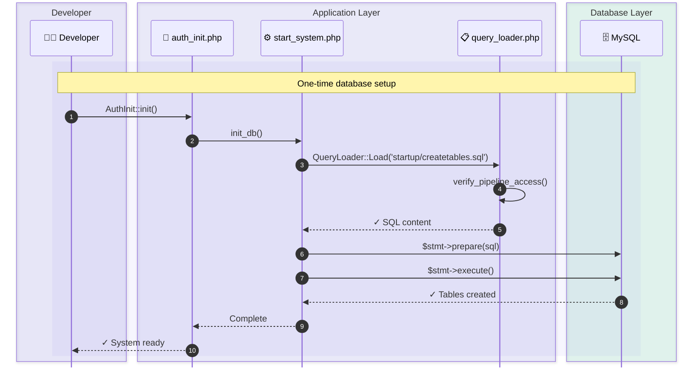
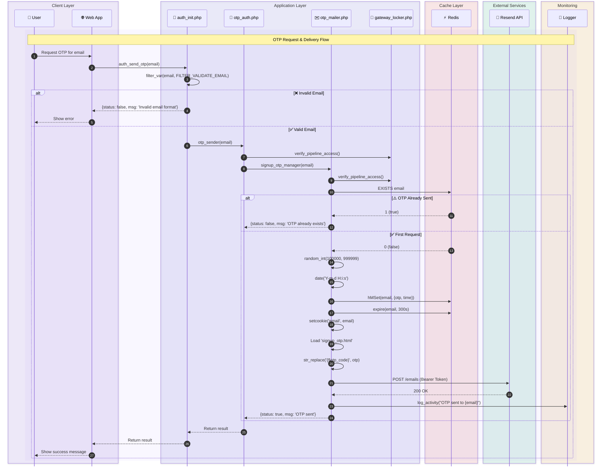
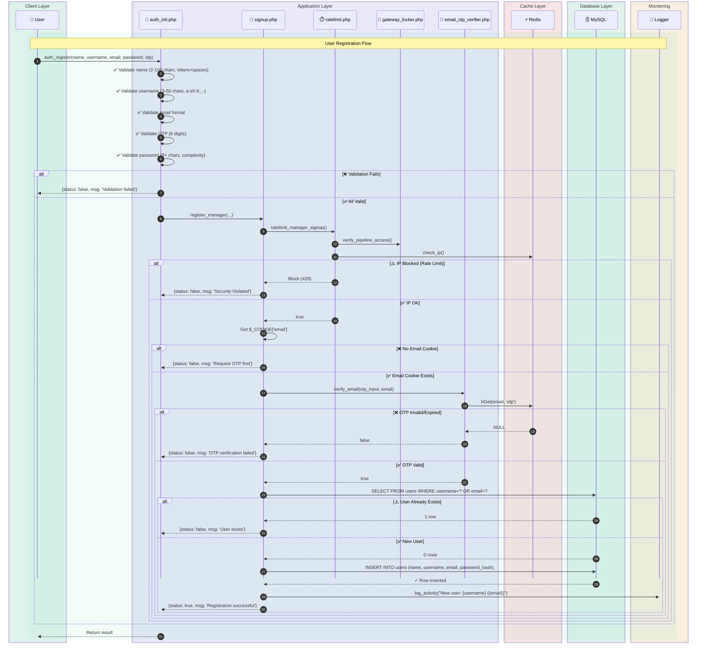
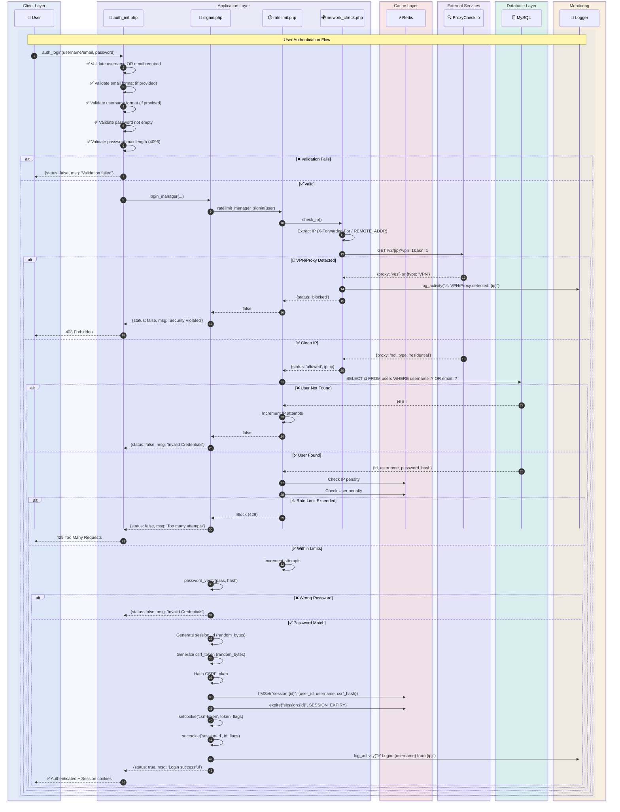
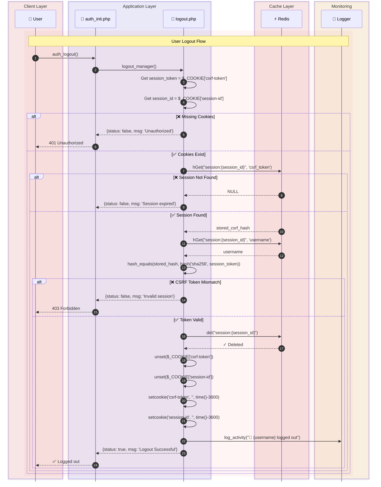
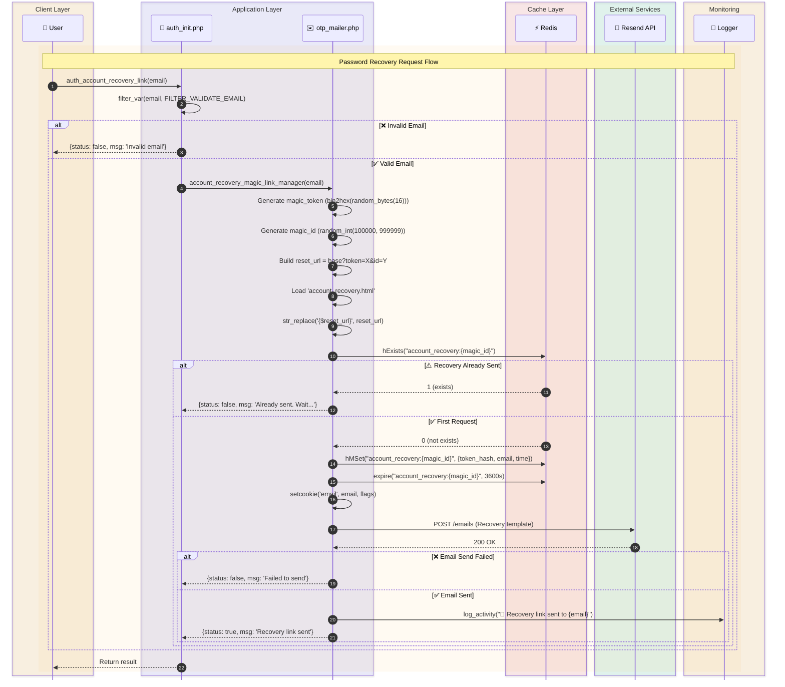
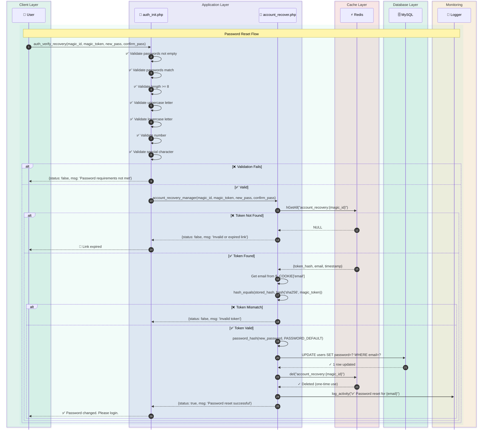
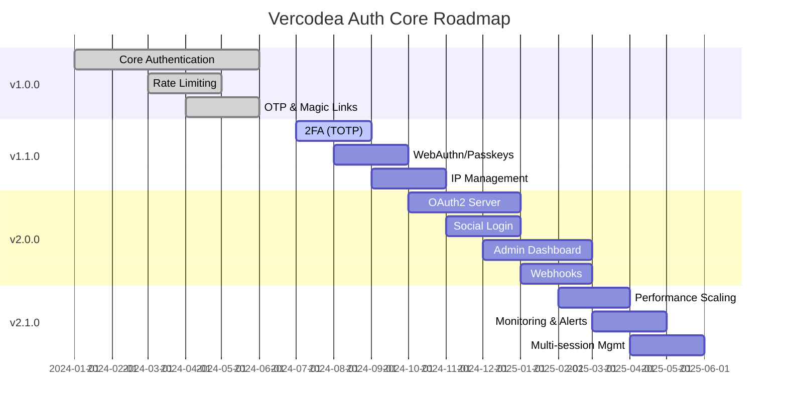

# Vercodea Auth Core

> 🔐 Enterprise-grade PHP authentication system with advanced security features, rate limiting, OTP verification, and magic link recovery.
>
> ⚡ **100% Plug and Play** - Install → Configure → Initialize → Done. Everything is automated.

[](https://www.php.net)
[](LICENSE)
[](https://packagist.org)
[](https://github.com)
[](https://github.com)

---

## 📋 Table of Contents

- [Features](#-features)
- [Requirements](#-requirements)
- [Installation](#-installation) - **4 simple steps, fully automated**
- [Configuration](#-configuration)
- [Quick Start](#-quick-start)
- [API Reference](#-api-reference)
- [Security Features](#-security-features)
- [Activity Logging](#-activity-logging)
- [Database Schema](#-database-schema)
- [Best Practices](#-best-practices)
- [Troubleshooting](#-troubleshooting)
- [License](#-license)

---

## ✨ Features

- 🔒 **bcrypt Password Hashing** - Industry-standard password encryption with PASSWORD_DEFAULT algorithm
- 🛡️ **Dual-Layer Rate Limiting** - IP-based and user-based throttling to prevent brute force attacks
- 🌐 **VPN/Proxy Detection** - Real-time detection via ProxyCheck.io API with automatic blocking
- 📧 **OTP Verification** - 6-digit time-limited one-time passwords via email (Resend API)
- 🔑 **Magic Link Recovery** - Secure password recovery with unique tokens and expiration
- 🍪 **Secure Session Management** - Redis-backed sessions with CSRF protection and HttpOnly cookies
- ✅ **Comprehensive Input Validation** - Email, username, password, and OTP format validation
- 🚫 **Common Password Blocklist** - 94,500+ weak passwords prevented (+ reserved password list)
- 📝 **Activity Logging** - Audit trail for all authentication events with timestamps and user info
- 🔐 **SQL Injection Prevention** - 100% prepared statements via PDO
- 🚪 **Pipeline Access Control** - File-level security to prevent unauthorized direct execution
- 🌍 **Multi-Environment Support** - Development and production configurations

---

## 📦 Requirements

| Component | Version | Purpose |
|-----------|---------|---------|
| **PHP** | 7.4+ or 8.0+ | Core runtime |
| **MySQL** | 5.7+ | User and session data storage |
| **Redis** | 5.0+ | Session, OTP, and rate limit caching |
| **PHP Extensions** | `pdo`, `redis`, `curl`, `openssl`, `json` | Required PHP modules |
| **Composer** | 1.9+ | Dependency manager |

### PHP Extensions Verification

```bash
php -m | grep -E "pdo|redis|curl|openssl|json"
```

---

## 🚀 Installation

**Plug and Play Setup** - Everything is automated. No manual SQL commands or database setup needed!

### Step 1: Install via Composer

```bash
composer require vercodea/auth-core
```

### Step 2: Configure Environment

```bash
cp vendor/vercodea/auth-core/.env.example .env
```

Edit `.env` and fill in your credentials:

```env
# Database
MYSQL_HOST=127.0.0.1
MYSQL_PORT=3306
MYSQL_USERNAME=root
MYSQL_PASSWORD=your_password
MYSQL_DBNAME=auth_system

# Redis
REDIS_HOST=127.0.0.1
REDIS_PORT=6379

# Email (Resend API)
OTP_API_KEY=your_resend_api_key
SEND_OTP_URL=https://api.resend.com/emails
DOMAIN=yourdomain.com

# Other settings as needed
```

**All environment variables have secure defaults.** See [Configuration](#-configuration) for complete list.

### Step 3: Initialize Database (One-time)

```php
<?php
require_once 'vendor/autoload.php';
require_once 'vendor/vercodea/auth-core/src/auth_init.php';

// Create all database tables automatically
AuthInit::init();

echo "✅ Database initialized successfully!";
?>
```

**That's it!** All required tables are created automatically. No manual SQL commands needed.

### Step 4: Start Using Authentication

```php
<?php
require_once 'vendor/autoload.php';
require_once 'vendor/vercodea/auth-core/src/auth_init.php';

// User login
$result = AuthInit::auth_login('johndoe', null, 'password');

// User registration
$result = AuthInit::auth_register('John Doe', 'johndoe', 'john@example.com', 'SecurePass123!', '123456');

// User logout
$result = AuthInit::auth_logout();
?>
```

---

## ⚙️ Configuration

### Environment Variables Reference

#### Database Configuration
| Variable | Default | Description |
|----------|---------|-------------|
| `MYSQL_HOST` | `127.0.0.1` | MySQL server hostname or IP |
| `MYSQL_PORT` | `3306` | MySQL server port |
| `MYSQL_USERNAME` | `root` | Database username |
| `MYSQL_PASSWORD` | `` | Database password |
| `MYSQL_DBNAME` | `` | Database name |
| `MYSQL_DIR_URL` | `null` | Unix socket path (optional) |
| `CHARSET` | `utf8mb4` | MySQL character set |

#### Redis Configuration
| Variable | Default | Description |
|----------|---------|-------------|
| `REDIS_HOST` | `127.0.0.1` | Redis server hostname |
| `REDIS_PORT` | `6379` | Redis server port |
| `REDIS_PASSWORD` | `` | Redis password (optional) |

#### Authentication Configuration
| Variable | Default | Description |
|----------|---------|-------------|
| `OTP_EXPIRES` | `300` | OTP validity in seconds (5 min) |
| `OTP_VERIFICATION_ENABLED` | `true` | Enable/disable OTP verification requirement |
| `OTP_API_KEY` | `` | Resend.com API key |
| `SEND_OTP_URL` | `https://api.resend.com/emails` | Email service endpoint |
| `DOMAIN` | `localhost` | Your application domain for emails |

#### Rate Limiting Configuration
| Variable | Default | Description |
|----------|---------|-------------|
| `MAX_ATTEMPTS` | `5` | Failed attempts before lockout |
| `PENALTY_PERIOD` | `60` | Lockout duration in seconds |
| `LIMIT_EXPIRES` | `3600` | Rate limit window in seconds (1 hour) |

#### Session Configuration
| Variable | Default | Description |
|----------|---------|-------------|
| `SESSION_EXPIRY` | `3600` | Session timeout in seconds (1 hour) |
| `SESSION_COOKIE_SECURE` | `false` | HTTPS only (set true in production) |
| `SESSION_COOKIE_HTTPONLY` | `true` | JavaScript access disabled |
| `SESSION_COOKIE_SAMESITE` | `Strict` | CSRF protection level |
| `SESSION_COOKIE_PATH` | `/` | Cookie path scope |
| `SESSION_COOKIE_DOMAIN` | `` | Cookie domain (empty string = current domain) |

#### Security Configuration
| Variable | Default | Description |
|----------|---------|-------------|
| `APP_ENV` | `development` | Environment mode (production/development) |
| `CURLOPT_SSL_VERIFYPEER` | `false` | SSL verification for external APIs (true in production) |
| `LOG_DIR` | `./logs` | Application activity log directory |
| `ACCOUNT_RECOVERY_LIMIT_TIME` | `300` | Magic link validity in seconds (5 min) |
| `ACCOUNT_RECOVERY_SUBDOMAIN_PATH` | `http://localhost/recover` | Password recovery page URL |

---

## 🎯 Quick Start

Here's a complete guide showing **ALL 7 public methods** in a real-world workflow:

```php
<?php
require_once 'vendor/autoload.php';
require_once 'vendor/vercodea/auth-core/src/auth_init.php';

// ============================================
// SETUP: Initialize Database (Run once)
// ============================================
AuthInit::init();
// ✅ All tables created automatically!

// ============================================
// FLOW 1: USER REGISTRATION
// ============================================

// 1. Send OTP to user's email
$result = AuthInit::auth_send_otp('newuser@example.com');
if ($result['status']) {
    echo "✅ OTP sent to email";
} else {
    echo "❌ " . $result['msg'];
}

// 2. User receives OTP (e.g., "123456"), then register
$result = AuthInit::auth_register(
    name: "John Doe",
    username: "johndoe",
    email: "newuser@example.com",
    password: "SecurePass123!",
    otp_input: "123456"  // OTP from email
);

if ($result['status']) {
    echo "✅ Registration successful!";
} else {
    echo "❌ " . $result['msg'];
}

// ============================================
// FLOW 2: USER LOGIN
// ============================================

// Option A: Login with username
$result = AuthInit::auth_login(
    username: "johndoe",
    email: null,  // null when using username
    password: "SecurePass123!"
);

// Option B: Login with email
$result = AuthInit::auth_login(
    username: null,  // null when using email
    email: "newuser@example.com",
    password: "SecurePass123!"
);

if ($result['status']) {
    echo "✅ Login successful! User session established.";
    // User is now authenticated
    // CSRF token and session ID are in secure cookies
} else {
    echo "❌ " . $result['msg'];
}

// ============================================
// FLOW 3: USER LOGOUT
// ============================================

$result = AuthInit::auth_logout();
if ($result['status']) {
    echo "✅ Logged out successfully";
    header('Location: /login');
} else {
    echo "❌ " . $result['msg'];
}

// ============================================
// FLOW 4: PASSWORD RECOVERY (Magic Link)
// ============================================

// Step 1: User requests recovery link
$result = AuthInit::auth_account_recovery_link('newuser@example.com');
if ($result['status']) {
    echo "✅ Recovery link sent to email";
    // Email contains: /reset?token=abc123xyz&id=456789
} else {
    echo "❌ " . $result['msg'];
}

// Step 2: User clicks link in email and submits new password
$result = AuthInit::auth_verify_recovery(
    magic_id: "456789",              // From URL: ?id=456789
    magic_token: "abc123xyz",        // From URL: ?token=abc123xyz
    new_password: "NewSecurePass456!",
    confirm_password: "NewSecurePass456!"
);

if ($result['status']) {
    echo "✅ Password reset successful!";
    header('Location: /login');
} else {
    echo "❌ " . $result['msg'];
}

?>
```

---

## 📚 All Public Methods Reference

| # | Method | Parameters | Returns | Purpose |
|---|--------|-----------|---------|---------|
| 1 | `init()` | None | `void` | Initialize database (one-time setup) |
| 2 | `auth_send_otp(email)` | `$email: string` | `['status' => bool, 'msg' => string]` | Send OTP to email |
| 3 | `auth_register(name, username, email, password, otp_input)` | 5 params | `['status' => bool, 'msg' => string]` | Register new user |
| 4 | `auth_login(username, email, password)` | 3 params | `['status' => bool, 'msg' => string]` | Login user |
| 5 | `auth_logout()` | None | `['status' => bool, 'msg' => string]` | Logout user |
| 6 | `auth_account_recovery_link(email)` | `$email: string` | `['status' => bool, 'msg' => string]` | Send recovery link |
| 7 | `auth_verify_recovery(id, token, password, confirm)` | 4 params | `['status' => bool, 'msg' => string]` | Reset password |

---

## ✅ Response Format

All methods (except `init()`) return a standardized response:

```php
[
    'status' => true,      // Success or failure
    'msg'    => 'Message'  // Success or error message
]
```

**Always check `$result['status']` before proceeding:**

```php
$result = AuthInit::auth_login('user', null, 'pass');

if ($result['status']) {
    // Success - user is logged in
    echo $result['msg'];  // "Login successful"
} else {
    // Failure - show error
    echo $result['msg'];  // Error reason
}
```

---

## 📚 API Reference

### AuthInit Class - All Public Methods

The `AuthInit` class provides 7 public methods for complete authentication workflow:

#### 1. Initialize Database

```php
AuthInit::init();
```

Initializes the database by creating all required tables. **Run this once during installation.**

---

#### 2. Send OTP

```php
$result = AuthInit::auth_send_otp($email);
```

**Parameters:**
- `$email` (string) - Email address to send OTP to

**Returns:** `['status' => bool, 'msg' => string]`

**Example:**
```php
$result = AuthInit::auth_send_otp('user@example.com');
if ($result['status']) {
    echo "OTP sent successfully";
}
```

---

#### 3. Register User

```php
$result = AuthInit::auth_register($name, $username, $email, $password, $otp_input);
```

**Parameters:**
- `$name` (string) - Full name (2-100 chars, letters and spaces)
- `$username` (string) - Username (3-50 chars, alphanumeric + `_.-`)
- `$email` (string) - Email address (valid format required)
- `$password` (string) - Password (8+ chars with uppercase, lowercase, number, special char)
- `$otp_input` (string) - 6-digit OTP from email

**Returns:** `['status' => bool, 'msg' => string]`

**Example:**
```php
$result = AuthInit::auth_register(
    'John Doe',
    'johndoe',
    'john@example.com',
    'SecurePass123!',
    '123456'
);
```

---

#### 4. Login User

```php
$result = AuthInit::auth_login($username, $email, $password);
```

**Parameters:**
- `$username` (string|null) - Username (use `null` if using email)
- `$email` (string|null) - Email (use `null` if using username)
- `$password` (string) - Password

**Returns:** `['status' => bool, 'msg' => string]`

**Example:**
```php
// Login with username
$result = AuthInit::auth_login('johndoe', null, 'SecurePass123!');

// OR login with email
$result = AuthInit::auth_login(null, 'john@example.com', 'SecurePass123!');
```

---

#### 5. Logout User

```php
$result = AuthInit::auth_logout();
```

**Parameters:** None

**Returns:** `['status' => bool, 'msg' => string]`

**Example:**
```php
$result = AuthInit::auth_logout();
if ($result['status']) {
    header('Location: /login');
}
```

---

#### 6. Request Password Recovery

```php
$result = AuthInit::auth_account_recovery_link($email);
```

**Parameters:**
- `$email` (string) - Email address to send recovery link to

**Returns:** `['status' => bool, 'msg' => string]`

**Example:**
```php
$result = AuthInit::auth_account_recovery_link('john@example.com');
// Email will contain: /reset?token=xyz&id=123456
```

---

#### 7. Verify Recovery & Reset Password

```php
$result = AuthInit::auth_verify_recovery($magic_id, $magic_token, $new_password, $confirm_password);
```

**Parameters:**
- `$magic_id` (string|int) - Magic ID from URL parameter `?id=`
- `$magic_token` (string) - Magic token from URL parameter `?token=`
- `$new_password` (string) - New password (same validation as registration)
- `$confirm_password` (string) - Password confirmation (must match new_password)

**Returns:** `['status' => bool, 'msg' => string]`

**Example:**
```php
$result = AuthInit::auth_verify_recovery(
    '123456',
    'xyz...',
    'NewSecurePass456!',
    'NewSecurePass456!'
);
```

---

### Response Format

All methods return a consistent structure:

```php
[
    'status' => true,   // Boolean: success or failure
    'msg'    => 'Text'  // String: message or error description
]
```

**Always check the status before proceeding:**

```php
$result = AuthInit::auth_login('user', null, 'pass');

if ($result['status']) {
    // ✅ Success - proceed
    echo $result['msg'];
} else {
    // ❌ Failure - show error
    echo "Error: " . $result['msg'];
}
```

---

## � Execution Flow Diagrams

### 1. 🚀 `AuthInit::init()` - System Initialization



### 2. 📧 `AuthInit::auth_send_otp()` - Send OTP Email



### 3. 👤 `AuthInit::auth_register()` - User Registration



### 4. 🔐 `AuthInit::auth_login()` - User Login



### 5. 🚪 `AuthInit::auth_logout()` - User Logout



### 6. 🔑 `AuthInit::auth_account_recovery_link()` - Send Recovery Link



### 7. 🔓 `AuthInit::auth_verify_recovery()` - Reset Password



---

## �🔐 Security Features

### Password Security

| Feature | Details |
|---------|---------|
| **Hashing Algorithm** | bcrypt (PASSWORD_DEFAULT) |
| **Minimum Length** | 8 characters |
| **Required Character Types** | Uppercase, lowercase, number, special character |
| **Blocked Passwords** | 94,500+ common weak passwords + reserved words |
| **Validation Rules** | Cannot match username or email, max 4096 chars |

### Rate Limiting & Brute Force Protection

| Feature | Details |
|---------|---------|
| **Signup Rate Limit** | IP-based: 5 attempts per hour (configurable) |
| **Signin Rate Limit** | Dual-layer: IP + User account tracking |
| **Lockout Duration** | 60 seconds (configurable via `PENALTY_PERIOD`) |
| **Penalty Response** | HTTP 429, retry-after header |

### Session & CSRF Protection

| Feature | Details |
|---------|---------|
| **Session Storage** | Redis-backed with automatic expiration |
| **Session Timeout** | 1 hour (configurable) |
| **CSRF Token** | Separated from session ID, SHA256 hashed |
| **Token Validation** | `hash_equals()` for timing-safe comparison |
| **Cookie Security** | HttpOnly, Secure, SameSite=Strict by default |

### Network Security

| Feature | Details |
|---------|---------|
| **VPN/Proxy Detection** | Real-time API check via ProxyCheck.io |
| **Blocked IPs** | VPN, proxy, and malicious IP detection |
| **Development Bypass** | Localhost (127.0.0.1) allowed in development |

### Input Validation

| Field | Validation Rules |
|-------|------------------|
| **Email** | RFC-compliant format via `filter_var()` |
| **Username** | 3-50 chars, alphanumeric + `_.-` |
| **Name** | 2-100 chars, letters and spaces only |
| **Password** | 8+ chars, mixed case, numbers, special chars |
| **OTP** | Exactly 6 digits |

### SQL Injection Prevention

- **100% Prepared Statements** - All database queries use parameterized statements
- **Query Loader** - SQL files managed through `QueryLoader` class
- **PDO Strict Mode** - `PDO::ERRMODE_EXCEPTION` enabled
- **No String Concatenation** - Zero direct user input in SQL

### Additional Security Measures

| Feature | Details |
|---------|---------|
| **Pipeline Access Control** | File-level security prevents direct execution |
| **Error Handling** | Production-safe logging, no error display to users |
| **OTP One-Time Use** | OTP deleted immediately after verification |
| **Magic Link Single-Use** | Recovery tokens deleted after password reset |
| **Activity Logging** | All authentication events logged with audit trail |

---

## 📝 Activity Logging

### Log Location

Logs are written to: `./logs/activity.log`

Configure with: `LOG_DIR` environment variable

### Log Format

```
[2024-06-13 14:23:45] [INFO] User johndoe logged in successfully from 192.168.1.1
[2024-06-13 14:24:12] [INFO] New user registered: janedoe (jane@example.com)
[2024-06-13 14:25:33] [SUCCESS] OTP sent to jane@example.com
[2024-06-13 14:26:01] [INFO] janedoe logged out successfully at 2024-06-13 14:26:01
[2024-06-13 14:27:15] [INFO] Password reset successful for email: jane@example.com
```

### Logged Events

| Event | Example Log Message |
|-------|-------------------|
| User Login | `User {username} logged in successfully from {IP}` |
| User Signup | `New user registered: {username} ({email})` |
| User Logout | `{username} logged out successfully at {timestamp}` |
| OTP Sent | `OTP sent to {email}` |
| OTP Verified | `OTP verified successfully for: {email}` |
| OTP Failed | `OTP verification failed (incorrect/expired) for: {email}` |
| Recovery Link | `Account recovery link sent to {email}` |
| Password Reset | `Password reset successful for email: {email}` |
| Rate Limit Hit | `Rate limit exceeded for IP: {IP} (signup attempts)` |
| Rate Limit Hit | `Rate limit exceeded for user: {username} (signin attempts)` |
| Account Locked | `Account locked: {username} exceeded max signin attempts from {IP}` |
| VPN Detected | `Security Alert: VPN/Proxy detected for IP: {IP}` |

---

## 🗄️ Database Schema

### Automatic Table Creation

When you call `AuthInit::init()`, all required database tables are created automatically. No manual SQL needed!

The tables are created from `src/Query/Query_commands/startup/createtables.sql` and include:

- **users** - User account information
- Any other supporting tables for full authentication functionality

### Users Table Structure

| Column | Type | Details |
|--------|------|----------|
| `id` | INT | Primary key, auto-increment |
| `username` | VARCHAR(255) | Unique login identifier |
| `email` | VARCHAR(255) | Unique email address |
| `password` | VARCHAR(255) | bcrypt hashed password |
| `name` | VARCHAR(100) | User display name |
| `created_at` | TIMESTAMP | Account creation time |
| `updated_at` | TIMESTAMP | Last update time |

**No manual CREATE TABLE commands required.** The `AuthInit::init()` method handles everything.

### Redis Schema

#### Session Storage
```
Key: session:{session_id}
Type: Hash
Fields:
  - user_id (int)
  - username (string)
  - csrf_token (string, SHA256 hashed)
TTL: SESSION_EXPIRY (default 3600 seconds)
```

#### OTP Storage
```
Key: {email}
Type: Hash
Fields:
  - otp (string, 6 digits)
  - time (string, timestamp)
TTL: OTP_EXPIRES (default 300 seconds)
```

#### Rate Limit Storage (Signup)
```
Key: reg-ratelimit:{ip}
Type: Hash
Fields:
  - attempts (int)
  - start-time (timestamp)
  - penalty-period (timestamp)
TTL: LIMIT_EXPIRES (default 3600 seconds)
```

#### Rate Limit Storage (Signin)
```
Key: log-ratelimit:{user_id}
Key: log-ratelimit:{ip}
Type: Hash
Fields:
  - attempts (int)
  - start-time (timestamp)
  - penalty-period (timestamp)
TTL: LIMIT_EXPIRES (default 3600 seconds)
```

#### Magic Link Recovery
```
Key: account_recovery:{magic_id}
Type: Hash
Fields:
  - token (string, SHA256 hashed)
  - email (string)
  - time (string, timestamp)
TTL: ACCOUNT_RECOVERY_LIMIT_TIME (default 300 seconds)
```

---

## ✅ Best Practices

### 1. Environment Security

```bash
# Always use .env for secrets
# Never commit .env to version control
# Add to .gitignore:
echo ".env" >> .gitignore

# Use strong API keys from Resend
OTP_API_KEY=re_your_secure_key_here_minimum_32_chars

# Production settings
APP_ENV=production
CURLOPT_SSL_VERIFYPEER=true
SESSION_COOKIE_SECURE=true
```

### 2. HTTPS Enforcement

```php
// In production, force HTTPS
if (empty($_SERVER['HTTPS']) || $_SERVER['HTTPS'] === 'off') {
    header('Location: https://' . $_SERVER['HTTP_HOST'] . $_SERVER['REQUEST_URI']);
    exit;
}
```

### 3. Error Handling

```php
// Always check response status
$response = AuthInit::auth_login($username, '', $password);

if (!$response['status']) {
    // Log error, show user-friendly message
    error_log("Login failed: " . $response['msg']);
    // Don't expose details to frontend
}
```

### 4. Rate Limiting

```php
// Configure based on your user base
// Conservative: MAX_ATTEMPTS=3, PENALTY_PERIOD=300
// Moderate: MAX_ATTEMPTS=5, PENALTY_PERIOD=60
// Lenient: MAX_ATTEMPTS=10, PENALTY_PERIOD=30

// Inform users about limits in UI
if ($response['reason'] === 'Too many attempts') {
    // Show "Please try again in X minutes"
}
```

### 5. Session Management

```php
// Always validate CSRF token for state-changing operations
$csrf_from_cookie = $_COOKIE['csrf-token'] ?? null;
$csrf_from_form = $_POST['csrf-token'] ?? null;

if (!hash_equals($csrf_from_cookie, $csrf_from_form)) {
    header('HTTP/1.1 403 Forbidden');
    exit('CSRF token mismatch');
}
```

### 6. OTP Verification

```php
// Verify OTP within valid window (5 minutes default)
// Rate limit OTP entry attempts (3-5 attempts)
// Log all OTP verification attempts
// Show remaining attempts to user
```

---

## 🔧 Troubleshooting

### Redis Connection Error

**Problem:** `Redis connection error: Connection refused`

**Solution:**
```bash
# Check Redis is running
redis-cli ping
# Output: PONG

# If not running, start Redis
redis-server

# Or with Docker
docker run -d -p 6379:6379 redis:latest
```

### MySQL Connection Error

**Problem:** `SQLSTATE[HY000]: General error: Can't connect to MySQL server`

**Solution:**
```bash
# Check MySQL credentials
mysql -h 127.0.0.1 -u root -p

# Verify .env settings match MySQL configuration
MYSQL_HOST=127.0.0.1
MYSQL_PORT=3306
MYSQL_USERNAME=root
MYSQL_PASSWORD=correct_password
MYSQL_DBNAME=auth_system
```

### OTP Not Sending

**Problem:** `Failed to send OTP. Please try again.`

**Solution:**
```bash
# Verify Resend API key
OTP_API_KEY=re_your_valid_key_here

# Check endpoint
SEND_OTP_URL=https://api.resend.com/emails

# Verify domain for email sending
DOMAIN=yourdomain.com

# Check logs for HTTP errors
tail -f ./logs/activity.log
tail -f ./logs/php-errors.log
```

### Initialization Failed

**Problem:** `AuthInit::init()` fails with database error

**Solution:**
```bash
# Verify MySQL connection
mysql -u root -p -h 127.0.0.1

# Check .env credentials match your MySQL setup
MYSQL_HOST=127.0.0.1
MYSQL_USERNAME=root
MYSQL_PASSWORD=your_password
MYSQL_DBNAME=auth_system

# Verify database exists
mysql -u root -p -e "SHOW DATABASES;" | grep auth_system
```

### Rate Limit Triggering Too Early

**Problem:** Users locked out after 2-3 attempts

**Solution:** Adjust in `.env`:
```env
MAX_ATTEMPTS=7              # Increase threshold
PENALTY_PERIOD=30           # Reduce lockout time
```

### Session Expiring Too Quickly

**Problem:** Users logged out after 15 minutes

**Solution:**
```env
SESSION_EXPIRY=7200         # Increase to 2 hours
```

### Password Validation Rejected

**Problem:** Strong password rejected as "too common"

**Requirements:** Minimum 8 characters with:
- 1 uppercase letter
- 1 lowercase letter  
- 1 number
- 1 special character (e.g., `!@#$%^&*`)

**Valid example:** `SecurePass123!@#`

---

## � Roadmap & Planned Features

### Current Version: 1.0.0 ✅ Production Ready

---

### 🔄 Phase 2: Enhanced Security (v1.1.0)

#### 🔐 Two-Factor Authentication (2FA)
- **TOTP (Time-based One-Time Password)** - Google Authenticator, Authy, Microsoft Authenticator
- **SMS-based 2FA** - Via Twilio or Vonage API
- **Email-based 2FA** - Backup codes via email
- **Recovery codes** - 10 one-time backup codes per user
- **Remember device** - Trusted device cookie for 30 days

```php
// Future API
$result = AuthInit::auth_enable_2fa($user_id, $method = 'totp');
$result = AuthInit::auth_verify_2fa($user_id, $code);
$result = AuthInit::auth_recovery_code($user_id); // Generate backup codes
```

#### 🔑 Passwordless Authentication (WebAuthn)
- **Passkeys support** - Biometric login (fingerprint, face ID)
- **Hardware tokens** - YubiKey, Titan Security Key
- **Platform authenticators** - Windows Hello, Apple Touch ID, Android fingerprint
- **Cross-device authentication** - QR code scan for mobile

```php
// Future API
$result = AuthInit::auth_register_passkey($user_id, $device_name);
$result = AuthInit::auth_login_passkey($passkey_id, $signature);
$result = AuthInit::auth_list_passkeys($user_id);
```

#### 🛡️ IP Whitelist/Blacklist Management
- **Allowlist** - Restrict access to specific IP ranges
- **Blocklist** - Automatically block malicious IPs
- **Geo-blocking** - Restrict by country code
- **IP reputation scoring** - Integration with threat intelligence feeds

```php
// Future API
$result = AuthInit::ip_whitelist_add($ip_range, $description);
$result = AuthInit::ip_blacklist_add($ip, $reason);
$result = AuthInit::ip_check_status($ip);
```

---

### 🔄 Phase 3: Enterprise Features (v2.0.0)

#### 🔌 OAuth2 / OpenID Connect
- **OAuth2 Server** - Authorization Code, Implicit, Client Credentials flows
- **OpenID Connect** - Identity layer on top of OAuth2
- **Social Login** - Google, GitHub, Facebook, Microsoft, Apple
- **JWT Access Tokens** - Stateless API authentication
- **Refresh Tokens** - Long-lived session management

```php
// Future API
$result = AuthInit::oauth_authorize($client_id, $redirect_uri, $scope);
$result = AuthInit::oauth_token($client_id, $client_secret, $code);
$result = AuthInit::oauth_social_login($provider, $access_token);
```

#### 🌐 Webhook Support
- **Real-time events** - Login, logout, registration, password change, 2FA enable/disable
- **Custom endpoints** - Configure any URL for webhook delivery
- **Retry mechanism** - Automatic retry with exponential backoff
- **Webhook signing** - HMAC-SHA256 signature verification

```php
// Future API
$result = AuthInit::webhook_register($event, $url, $secret);
$result = AuthInit::webhook_test($webhook_id);
$result = AuthInit::webhook_logs($webhook_id);
```

#### 🎛️ Audit Dashboard UI
- **Admin dashboard** - Complete user management interface
- **Activity viewer** - Search and filter authentication events
- **Security metrics** - Login success/failure rates, active sessions, rate limit hits
- **User management** - Create, edit, delete, suspend users
- **Role management** - RBAC (Role-Based Access Control)
- **Audit log export** - CSV, JSON, PDF formats

```php
// Future API
$result = AuthInit::admin_get_users($filters, $pagination);
$result = AuthInit::admin_get_audit_logs($filters, $date_range);
$result = AuthInit::admin_suspend_user($user_id, $reason, $duration);
```

#### 👑 Admin Authentication System
- **Separate admin login** - Isolated from user authentication
- **Admin roles** - Super admin, Security admin, Audit viewer
- **Admin audit logging** - All admin actions logged
- **MFA enforcement** - Mandatory 2FA for admin accounts
- **Session timeout** - Shorter session expiry for admin accounts

```php
// Future API
$result = AuthInit::admin_login($username, $password, $totp_code);
$result = AuthInit::admin_create_user($user_data, $role);
$result = AuthInit::admin_reset_user_password($user_id);
```

---

### 🔄 Phase 4: Performance & Scale (v2.1.0)

#### ⚡ Performance Optimizations
- **Database indexing** - Optimized queries for high throughput
- **Redis clustering** - Horizontal scaling for session storage
- **Read replicas** - Load balancing database reads
- **Caching layer** - User data, permission, rate limit caching

#### 📊 Monitoring & Alerting
- **Health check endpoints** - `/health`, `/ready`, `/live`
- **Metrics export** - Prometheus format for Grafana dashboards
- **Alerting rules** - High failure rates, rate limit breaches, suspicious activity
- **SLO tracking** - Service Level Objective monitoring

#### 🔄 Session Management Enhancements
- **Cross-device sessions** - Track active sessions per user
- **Session revocation** - Remotely terminate any session
- **Session geolocation** - Show login locations on map
- **Device fingerprinting** - Detect suspicious device changes

---

### 📅 Release Timeline

| Version | Features | Target Date |
|---------|----------|-------------|
| **v1.0.0** | ✅ Current - Core authentication system | Released |
| **v1.1.0** | 🔄 2FA + WebAuthn + IP Management | Q3 2026 |
| **v2.0.0** | 🔄 OAuth2/SSO + Webhooks + Admin Dashboard | Q4 2026 |
| **v2.1.0** | 🔄 Performance + Monitoring + Multi-session | Q1 2027 |

---

### 🗳️ Feature Request

Have a feature in mind? [Open an issue](https://github.com/vercodea/auth-core/issues) or [start a discussion](https://github.com/vercodea/auth-core/discussions)!

**Priority is determined by community demand.** ⭐

---

### 🤝 Contributing

We welcome contributions! Areas needing help:

- 🧪 Unit tests (PHPUnit)
- 📖 Documentation improvements
- 🌐 Translations (i18n)
- 🔌 Additional OAuth providers
- 🎨 Admin dashboard UI (React/Vue)

See [CONTRIBUTING.md](CONTRIBUTING.md) for guidelines.

**Stay updated:** ⭐ Star the repo on GitHub to receive release notifications!

---

### 🎨 Visual Timeline



---

### 📋 Feature Comparison Table

| Feature | v1.0.0 | v1.1.0 | v2.0.0 | v2.1.0 |
|---------|--------|--------|--------|--------|
| **Core Auth** | ✅ | ✅ | ✅ | ✅ |
| **Rate Limiting** | ✅ | ✅ | ✅ | ✅ |
| **OTP Verification** | ✅ | ✅ | ✅ | ✅ |
| **Magic Link Recovery** | ✅ | ✅ | ✅ | ✅ |
| **VPN/Proxy Detection** | ✅ | ✅ | ✅ | ✅ |
| **Activity Logging** | ✅ | ✅ | ✅ | ✅ |
| **2FA (TOTP)** | ❌ | 🔄 | ✅ | ✅ |
| **WebAuthn/Passkeys** | ❌ | 🔄 | ✅ | ✅ |
| **IP Whitelist/Blacklist** | ❌ | 🔄 | ✅ | ✅ |
| **OAuth2/OpenID Connect** | ❌ | ❌ | 🔄 | ✅ |
| **Social Login** | ❌ | ❌ | 🔄 | ✅ |
| **Admin Dashboard** | ❌ | ❌ | 🔄 | ✅ |
| **Webhooks** | ❌ | ❌ | 🔄 | ✅ |
| **Multi-session Management** | ❌ | ❌ | ❌ | 🔄 |
| **Performance Scaling** | ❌ | ❌ | ❌ | 🔄 |

---

## �📄 License

Vercodea Auth Core is open-source software licensed under the [MIT License](LICENSE).

```
MIT License

Copyright (c) 2026 Vercodea

Permission is hereby granted, free of charge, to any person obtaining a copy
of this software and associated documentation files (the "Software"), to deal
in the Software without restriction, including without limitation the rights
to use, copy, modify, merge, publish, distribute, sublicense, and/or sell
copies of the Software, and to permit persons to whom the Software is
furnished to do so, subject to the following conditions:

The above copyright notice and this permission notice shall be included in all
copies or substantial portions of the Software.
```

---

## � How It Works

### Fully Automated Setup

1. **Install** → `composer require vercodea/auth-core`
2. **Configure** → Copy `.env.example` to `.env`, fill in credentials
3. **Initialize** → Call `AuthInit::init()` once (creates all database tables)
4. **Use** → Start calling `AuthInit::auth_login()`, `AuthInit::auth_register()`, etc.

**No manual SQL. No table creation. No MySQL CLI. Everything automatic.**

---

## �🔗 Resources & Support

- 📖 **Documentation:** [Full Docs](https://docs.vercodea.com)
- 🐛 **Bug Reports:** [GitHub Issues](https://github.com/vercodea/auth-core/issues)
- 💬 **Discussions:** [GitHub Discussions](https://github.com/vercodea/auth-core/discussions)
- 📦 **Package:** [Packagist](https://packagist.org/packages/vercodea/auth-core)
- 🌐 **Website:** coming soon

## 🤝 Contributing

Contributions are welcome! Please read our [Contributing Guidelines](docs/CONTRIBUTING.md) before submitting PRs.

### Development Setup

```bash
git clone https://github.com/vercodea/auth-core.git
cd auth-core
composer install
cp .env.example .env
# Configure .env with local database/Redis
vendor/bin/phpunit
```

---

## 📞 Support & Security

- **Security Issues:** vercodea@gmail.com (please do not open public issues for security vulnerabilities)
- **General Support:** vercodea@gmail.com
- **Feature Requests:** [GitHub Discussions](https://github.com/vercodea/auth-core/discussions)

---

## 🎉 Why Vercodea Auth Core?

✨ **Zero Configuration** - Sensible defaults for all settings

⚡ **Plug and Play** - `composer require` → configure `.env` → `AuthInit::init()` → done

🔒 **Enterprise Security** - All security best practices built-in

📊 **Production Ready** - Used in production applications

📝 **Complete Audit Trail** - Every auth event logged

🚀 **Easy Integration** - Simple API, one class to learn

---

## 📊 Status & Roadmap

### Current Version: 1.0.0

### ✅ Completed Features
- ✅ User registration with OTP
- ✅ User login with rate limiting
- ✅ Session management
- ✅ Password recovery with magic links
- ✅ VPN/proxy detection
- ✅ Activity logging
- ✅ Comprehensive input validation

### 🚧 Planned Features
- 🔄 2FA (Two-Factor Authentication)
- 🔄 OAuth2 / OpenID Connect support
- 🔄 Passwordless authentication (WebAuthn)
- 🔄 Audit dashboard UI
- 🔄 IP whitelist/blacklist management
- 🔄 Webhook support for custom integrations
- 🔄 Admin authentication system

---

> **Install → Configure → Init → Use**
>
> **That's all you need to do.** Everything else is automated.
>
> No manual SQL. No table creation. No MySQL CLI. **100% plug and play.** 🚀

---

 **[Audit Trail](docs/AUDIT.md)** - View project transparency and history

 ---

## 💰 Support This Project

### Help Us Build Better Security

Vercodea Auth Core is and will always be **free and open-source** under the MIT license.

If this project saves you time, helps secure your application, or makes your life easier — please consider supporting its continued development:

#### 🎯 Sponsorship Options

- **[GitHub Sponsors](https://github.com/sponsors/vercodea)** - Recurring monthly support
- **[Buy Me a Coffee](https://buymeacoffee.com/princeaka140)** - One-time contribution by the author


#### 💼 Enterprise Support

For consulting, custom features, or enterprise support:  
📧 **Email:** vercodea@gmail.com  
🌐 **Website:** coming soon

#### ⭐ Free Ways to Support

No budget? No problem! You can still help:

- **Star on GitHub** - Increases visibility and helps others discover the project
- **Share the project** - Tweet about it, mention it in blogs, forums
- **Contribute code** - Submit PRs for features, fixes, or documentation
- **Report bugs** - Help us improve quality and stability
- **Write documentation** - Improve guides and examples
- **Answer questions** - Help community members in discussions

**Every form of support matters!** 🙏

---

**Made with ❤️ by [Prince Uche](https://github.com/princeaka140)**

**Admin · Author · Developer**

*Last Updated: June 14, 2026*
